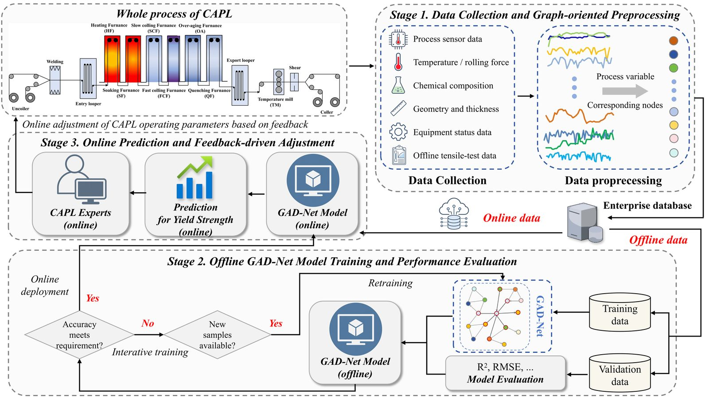

# 🧠 GAD-Net: Knowledge-Guided Heterogeneous Graph Attention Network for Steel Yield-Strength Prediction

<p align="center">
  <b>Mechanism-Prior Graph Learning · Adaptive Topology Refinement · Heterogeneous Graph Attention · Dynamic Sample Weighting</b>
</p>
<p align="center">
  
  
  
  
</p>


<p align="center">
  <a href="#overview"><b>Overview</b></a>
  &nbsp;·&nbsp;
  <a href="#framework"><b>Framework</b></a>
  &nbsp;·&nbsp;
  <a href="#running-the-experiment"><b>Running</b></a>
  &nbsp;·&nbsp;
  <a href="#citation"><b>Paper</b></a>
</p>

<p align="center">
  <b>Official implementation of GAD-Net for yield-strength prediction in continuous annealing production lines.</b>
</p>

---

## 📌 Overview

This repository provides the official implementation of **GAD-Net**, a knowledge-guided heterogeneous graph attention network for predicting the yield strength of cold-rolled strip steel in continuous annealing production lines (CAPLs).

<p align="center">
  
</p>

<p align="center"><em>Overall workflow of GAD-Net for CAPL yield-strength prediction.</em></p>

GAD-Net is a knowledge-guided heterogeneous graph attention network for yield-strength prediction of cold-rolled strip steel in continuous annealing production lines. It organizes operating, procedure, conditional, and composition variables as heterogeneous graph nodes, integrates mechanistic priors with adaptive topology learning, and models relation-specific process dependencies through heterogeneous graph attention. A dynamic sample weighting mechanism further improves prediction for difficult and sparsely represented boundary-region samples, enabling reliable performance under data-scarce conditions.

## 🔥 Highlights

* A heterogeneous graph represents 22 CAPL process variables according to their physical roles.
* Mechanistic priors constrain adaptive graph learning while allowing data-driven refinement.
* Heterogeneous graph attention captures cross-domain process dependencies.
* Dynamic sample weighting emphasizes difficult and sparse boundary-region samples.
* GAD-Net achieves superior yield-strength prediction under data-scarce conditions.

## 🧩 Framework

<p align="center">
  
</p>

The training workflow is organized as follows:

```text
Authorized CAPL production data
        |
        v
Physical admissibility checks
        |
        v
Repeated stratified five-fold partitioning
        |
        v
Training-fold-only standardization and weighting setup
        |
        v
Mechanism-prior graph construction
        |
        v
Prior-constrained adaptive graph learning
        |
        v
Heterogeneous graph attention prediction
        |
        v
Validation-based early stopping and model selection
        |
        v
Evaluation on the held-out test fold
```

The industrial application context is shown below.

<p align="center">
  
</p>

<p align="center"><em>Application scenario for CAPL yield-strength prediction.</em></p>

## 📊 Experimental Protocol

The default experiment uses **1000 industrial CAPL production records**, **22 process variables**, five independent random seeds, and five stratified folds. Stratification follows the yield strength distribution.

For each fold, input standardization and dynamic sample-weight parameters are fitted using the training portion only. The validation portion is used for early stopping and model selection and the held-out test fold is evaluated after training.

The runner records fold-level predictions, metrics, and training logs, then summarizes mean performance, sample standard deviation. Reported metrics include RMSE, MAE, MAPE, R², and boundary-region (BR)_MAE. Paired significance tests are also conducted for model comparisons using matched evaluation folds.

## ⚙️ Configuration

Representative settings are summarized below. The complete implementation settings are defined in the source files and can be adjusted through the model configuration.

| Component | Setting |
| --- | --- |
| Task | Cold-rolled strip steel yield-strength prediction |
| Production data | 1000 CAPL records, 22 process variables |
| Validation strategy | Five-fold stratified cross-validation |
| Independent seeds | 5 |
| Graph type | Knowledge-guided heterogeneous graph |
| Graph refinement | Prior-constrained adaptive topology learning |
| Attention mechanism | Multi-head heterogeneous graph attention |
| Optimization | Dynamic sample-weighted training |
| Evaluation | RMSE, MAE, MAPE, R², and BR_MAE |

## 🛠️ Installation

After obtaining the repository, enter its root directory and create an environment:

```bash
cd GAD-Net
python -m venv .venv
```

Linux/macOS:

```bash
source .venv/bin/activate
```

Windows PowerShell:

```powershell
.venv\Scripts\Activate.ps1
```

Install the required packages:

```bash
python -m pip install --upgrade pip
pip install -r requirements.txt
```

Install a PyTorch build compatible with your CUDA driver if GPU training is required.

## 🚀 Running the Experiment

From the repository root:

```bash
python main.py \
    --data data/CAPL.csv \
    --gpu 0 \
    --output results_5fold_cv/main
```

Use `--gpu -1` for a CPU smoke test:

```bash
python main.py \
    --data data/CAPL.csv \
    --gpu -1 \
    --output results_cpu/main
```

The pipeline sequentially performs data loading, fold-specific preprocessing, graph construction, adaptive graph learning, model training, validation-based model selection, and held-out evaluation.

## 📁 Repository Structure

```text
GAD-Net/
├── images/
│   ├── fig4_workflow.jpg
│   ├── fig5_application.jpg
│   └── fig7_framework.jpg
├── models/
│   ├── gad_net.py
│   └── __init__.py
├── config.py
├── data_preprocessing.py
├── fold_preprocessing.py
├── graph_construction.py
├── evaluate.py
├── train.py
├── main.py
├── requirements.txt
└── README.md
```

The main components are organized as follows:

* `models/`: GAD-Net architecture, graph learning, and attention modules.
* `graph_construction.py`: mechanism-prior topology and adaptive graph initialization.
* `data_preprocessing.py`: dataset loading and general preprocessing utilities.
* `fold_preprocessing.py`: leakage-safe fold-specific preprocessing.
* `train.py`: model optimization and training procedures.
* `evaluate.py`: prediction evaluation and metric calculation.
* `main.py`: complete cross-validation experiment pipeline.

## 📦 Outputs

Experimental results are written under:

```text
results_5fold_cv/
├── checkpoints/
├── predictions/
├── metrics/
├── logs/
└── main_summary.json
```

The output files contain model checkpoints, fold-level predictions, evaluation metrics, training logs, and experiment summaries.

## 📏 Evaluation Metrics

* **Root Mean Squared Error (RMSE)**
* **Mean Absolute Error (MAE)**
* **Mean Absolute Percentage Error (MAPE)**
* **Coefficient of Determination (R²)**
* **Boundary-region (BR)_MAE**

Lower RMSE, MAE, MAPE, and BR_MAE indicate smaller prediction errors, while higher R² indicates stronger agreement between predicted and measured yield strength.

## 📰 News

* **May 2026** — GAD-Net manuscript and source code completed.
* **September 2026** — Source code publicly released with the accompanying manuscript.

## 🙏 Acknowledgements

This project builds upon open-source tools for PyTorch, heterogeneous graph learning, and scientific machine learning. We thank the open-source community for the software and resources that support this work.

## 📖 Citation

If you use GAD-Net in your research, please cite the accompanying manuscript:

```bibtex
@article{zhang2026gadnet,
  title   = {Knowledge Guided Heterogeneous Graph Attention Network for Yield Strength Prediction of Cold Rolled Strip Steel in Continuous Annealing Production Lines},
  author  = {Zhang, Weizhi and Li, Yiteng and Pan, Jianfei and Sun, Xuexin and Wang, Xinran and Zhang, Jingchuan and Wang, Xianpeng},
  year    = {2026},
}
```

## 📬 Contact

For questions about the implementation, experimental configuration, or reproducibility, please open an issue in the repository.

## 📄 License

This code is released for research use. The enterprise dataset is not included.
