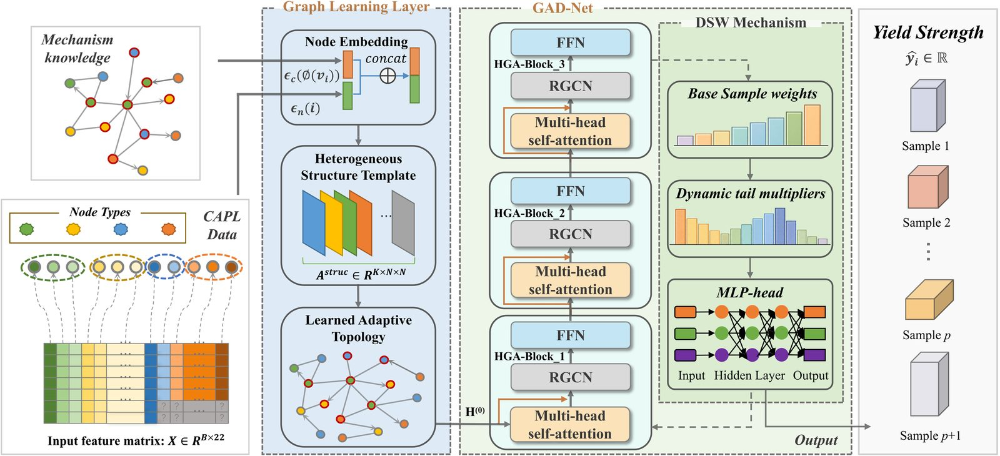
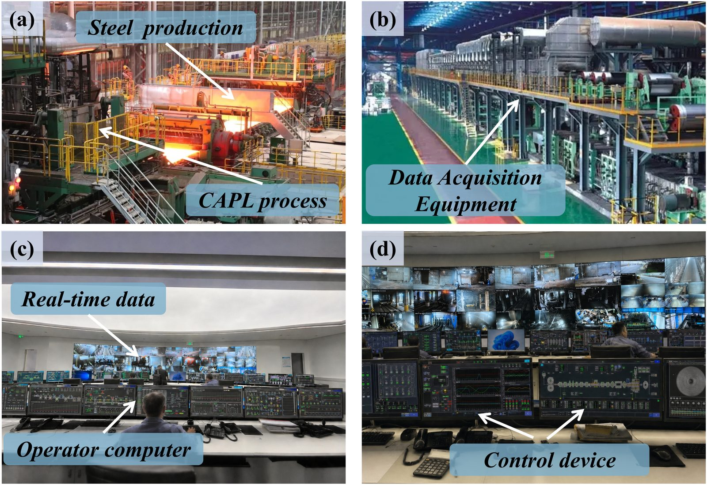

# 🧠 GAD-Net: Knowledge-Guided Heterogeneous Graph Attention Network for Steel Yield-Strength Prediction

<p align="center">
  <b>Mechanism-Prior Graph Learning · Adaptive Topology Refinement · Heterogeneous Graph Attention · Dynamic Sample Weighting</b>
</p>
<p align="center">
  
  
  
  
</p>


<p align="center">
  <a href="#overview"><b>Overview</b></a>
  &nbsp;·&nbsp;
  <a href="#framework"><b>Framework</b></a>
  &nbsp;·&nbsp;
  <a href="#running-the-experiment"><b>Running</b></a>
  &nbsp;·&nbsp;
  <a href="#citation"><b>Paper</b></a>
</p>

<p align="center">
  <b>Official implementation of GAD-Net for yield-strength prediction in continuous annealing production lines.</b>
</p>

---

## 📌 Overview

This repository provides the official implementation of **GAD-Net**, a knowledge-guided heterogeneous graph attention network for predicting the yield strength of cold-rolled strip steel in continuous annealing production lines (CAPLs).

<p align="center">
  
</p>

<p align="center"><em>Overall workflow of GAD-Net for CAPL yield-strength prediction.</em></p>

GAD-Net is a knowledge-guided heterogeneous graph attention network for yield-strength prediction of cold-rolled strip steel in continuous annealing production lines. It organizes operating, procedure, conditional, and composition variables as heterogeneous graph nodes, integrates mechanistic priors with adaptive topology learning, and models relation-specific process dependencies through heterogeneous graph attention. A dynamic sample weighting mechanism further improves prediction for difficult and sparsely represented boundary-region samples, enabling reliable performance under data-scarce conditions.

## 🔥 Highlights

* A heterogeneous graph represents 22 CAPL process variables according to their physical roles.
* Mechanistic priors constrain adaptive graph learning while allowing data-driven refinement.
* Heterogeneous graph attention captures cross-domain process dependencies.
* Dynamic sample weighting emphasizes difficult and sparse boundary-region samples.
* GAD-Net achieves superior yield-strength prediction under data-scarce conditions.

## 🧩 Framework

<p align="center">
  
</p>

The training workflow is organized as follows:

```text
Authorized CAPL production data
        |
        v
Physical admissibility checks
        |
        v
Stratified five-fold CV repeated with five seeds
        |
        v
Training-fold-only preprocessing and graph construction
        |
        v
Prior-gated adaptive heterogeneous graph learning
        |
        v
Validation-based early stopping
        |
        v
Held-out test evaluation
        |
        v
Aggregation across 25 runs
```

The industrial application context is shown below.

<p align="center">
  
</p>

<p align="center"><em>Application scenario for CAPL yield-strength prediction.</em></p>

## 📊 Experimental Protocol

The default setting uses **1,000 industrial CAPL records** with **22 process variables**. Experiments are conducted with **five random seeds** and **five-fold stratified cross-validation** based on yield strength distribution.

All preprocessing steps, including standardization and dynamic sample-weight estimation, are fitted using the training split only. Validation splits are used for early stopping and model selection, while held-out test splits are used for final evaluation.

The runner records fold-level predictions, metrics, and training logs, and reports the mean and sample standard deviation across folds. Metrics include **RMSE, MAE, MAPE, R²**, and **BR_MAE**. Paired significance tests are performed using matched evaluation folds.


## 🛠️ Installation

After obtaining the repository, enter its root directory and create an environment:

```bash
cd GAD-Net
python -m venv .venv
```

Linux/macOS:

```bash
source .venv/bin/activate
```

Windows PowerShell:

```powershell
.venv\Scripts\Activate.ps1
```

Install the required packages:

```bash
python -m pip install --upgrade pip
pip install -r requirements.txt
```

Install a PyTorch build compatible with your CUDA driver if GPU training is required.

## 🚀 Running

From the repository root:

```bash
python main.py \
    --data data/CAPL.csv \
    --gpu 0 \
    --output results_5fold_cv/main
```


The pipeline sequentially performs data loading, fold-specific preprocessing, graph construction, adaptive graph learning, model training, validation-based model selection, and held-out evaluation.


## 📏 Evaluation Metrics

* **Root Mean Squared Error (RMSE)**
* **Mean Absolute Error (MAE)**
* **Mean Absolute Percentage Error (MAPE)**
* **Coefficient of Determination (R²)**
* **Boundary-region (BR)_MAE**

Lower RMSE, MAE, MAPE, and BR_MAE indicate smaller prediction errors, while higher R² indicates stronger agreement between predicted and measured yield strength.

## 📰 News

* **May 2026** — GAD-Net manuscript and source code completed.
* **September 2026** — Source code publicly released with the accompanying manuscript.

## 🙏 Acknowledgements

This project builds upon open-source tools for PyTorch, heterogeneous graph learning, and scientific machine learning. We thank the open-source community for the software and resources that support this work.

## 📖 Citation

If you use GAD-Net in your research, please cite the accompanying manuscript:

```bibtex
@article{zhang2026gadnet,
  title   = {Knowledge Guided Heterogeneous Graph Attention Network for Yield Strength Prediction of Cold Rolled Strip Steel in Continuous Annealing Production Lines},
  author  = {Zhang, Weizhi and Li, Yiteng and Pan, Jianfei and Sun, Xuexin and Wang, Xinran and Zhang, Jingchuan and Wang, Xianpeng},
  year    = {2026},
}
```

## 📬 Contact

For questions about the implementation, experimental configuration, or reproducibility, please open an issue in the repository.

